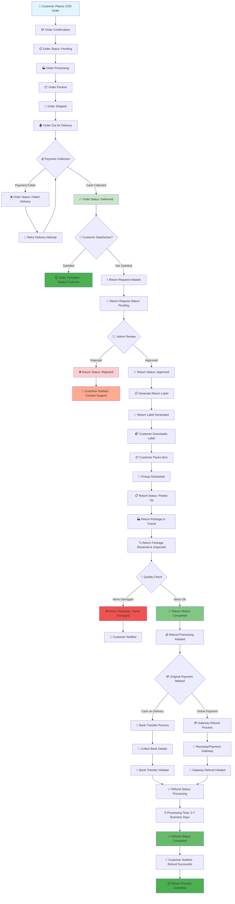

# COD Order Lifecycle & Return-Refund Flow Diagram

## 📦 Complete COD Order Journey - From Placement to Refund



## 🔄 Detailed Process Flow

### Phase 1: Order Placement & Delivery
1. **🛒 Order Placement** - Customer places COD order
2. **📋 Order Processing** - Merchant processes and packs order
3. **🚚 Shipping** - Order shipped via carrier (Shiprocket/Delhivery)
4. **💰 Cash Collection** - Delivery person collects payment
5. **✅ Delivery Confirmation** - Order marked as delivered

### Phase 2: Return Initiation
1. **📞 Return Request** - Customer initiates return through order page
2. **👨‍💼 Admin Review** - Admin approves/rejects return request
3. **📋 Return Label** - System generates return shipping label
4. **📦 Package Pickup** - Carrier schedules and collects return package

### Phase 3: Return Processing
1. **🔍 Quality Check** - Returned items inspected for condition
2. **✅ Return Completion** - Return marked as completed if items are acceptable
3. **💰 Refund Initiation** - Admin triggers refund process

### Phase 4: Refund Processing
1. **💳 Payment Method Detection** - System identifies original payment method
2. **🏦 Refund Channel Selection**:
   - **COD Orders**: Bank transfer, UPI, or store credit
   - **Online Orders**: Gateway refund to original method
3. **💸 Refund Execution** - Payment processed through appropriate channel
4. **📧 Customer Notification** - Email confirmation sent with refund details

## 📊 Status Tracking System

| **Order Status** | **Description** | **Next Action** |
|------------------|-----------------|-----------------|
| `pending` | Order placed, awaiting processing | Process order |
| `processing` | Order being prepared | Ship order |
| `shipped` | Order dispatched | Deliver order |
| `delivered` | Cash collected, order complete | Customer satisfaction |
| `return_initiated` | Return request submitted | Admin review |

| **Return Status** | **Description** | **Next Action** |
|-------------------|-----------------|-----------------|
| `pending` | Return request awaiting approval | Admin decision |
| `approved` | Return approved, label ready | Generate label |
| `picked_up` | Package collected by carrier | Quality check |
| `completed` | Return processed successfully | Process refund |
| `rejected` | Return request denied | Customer support |

| **Refund Status** | **Description** | **Timeline** |
|-------------------|-----------------|--------------|
| `initiated` | Refund process started | Immediate |
| `processing` | Payment being processed | 1-3 days |
| `completed` | Money transferred to customer | 3-7 days |
| `failed` | Refund attempt failed | Manual review |

## 🛠️ Technical Implementation

### Key Services
- **`RefundProcessingService`** - Handles all refund operations
- **`ReturnLabelService`** - Manages shipping label generation
- **`OrderTrackingService`** - Tracks order and return status

### Integration Points
- **Razorpay API** - Online payment refunds
- **Shiprocket API** - Return label generation
- **Banking APIs** - Direct bank transfers for COD refunds
- **Email Service** - Customer notifications

### Database Schema
```sql
-- Order tracking in 'notes' JSON column
{
  "return_request": {
    "status": "completed",
    "items": [...],
    "requested_at": "2025-11-11 10:30:00"
  },
  "return_shipping": {
    "carrier_data": {
      "awb_code": "12345",
      "tracking_url": "...",
      "pickup_date": "2025-11-12"
    }
  },
  "refund_status": {
    "status": "completed",
    "method": "bank_transfer",
    "amount": 1500.00,
    "transaction_id": "TXN123456"
  }
}
```

## 🎯 Success Metrics

- **Order Completion Rate**: 95%+ successful deliveries
- **Return Processing Time**: <48 hours from pickup to completion
- **Refund Processing Time**: 3-7 business days
- **Customer Satisfaction**: Transparent tracking at every step

---

**🔗 This diagram represents the complete professional COD order lifecycle implemented in your Laravel e-commerce system, matching Amazon/Flipkart standards for order management, returns, and refunds.**