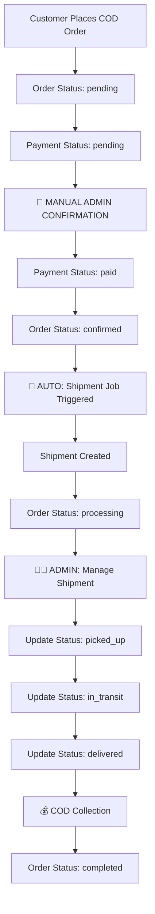
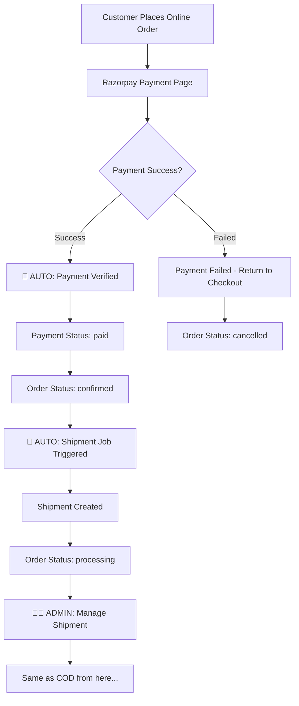

# 🚀 Complete Order Processing Workflows

> **Comprehensive Guide to COD vs Online Payment Processing**  
> *Including Background Processes, Admin Flows, and System Automation*

---

## 📋 **Table of Contents**

1. [COD Payment Workflow](#cod-payment-workflow)
2. [Online Payment Workflow](#online-payment-workflow)
3. [Background Processes](#background-processes)
4. [Admin Management Flows](#admin-management-flows)
5. [System Comparison](#system-comparison-cod-vs-online)
6. [Production Implementation](#production-implementation)

---

## 🏷️ **COD Payment Workflow**

### **Overview**: Cash on Delivery Process



### **🔄 Step-by-Step COD Flow**

#### **Step 1: Order Placement (Automatic)**
```php
// Customer completes checkout
$order = Order::create([
    'user_id' => $customer->id,
    'payment_method' => 'cod',
    'status' => 'pending',           // ⚠️ Requires admin confirmation
    'payment_status' => 'pending',   // ⚠️ Will be paid on delivery
    'grand_total' => $grandTotal,
    // ... other order data
]);

// Create payment record
PaymentService::createCODPayment($order);

// Send order confirmation email
Mail::to($customer->email)->queue(new OrderConfirmation($order));
```

**What Happens:**
- ✅ Order created with "pending" status
- ✅ Customer receives order confirmation email
- ✅ Admin gets notification of new COD order
- ❌ **NO automatic shipment creation** (requires admin approval)

---

#### **Step 2: Admin Confirmation (Manual Process)**

**Admin Dashboard Actions:**
```php
// Admin route: /admin/orders/{order}/confirm-cod
Route::post('admin/orders/{order}/confirm-cod', function(Order $order) {
    $order->update([
        'payment_status' => 'paid',      // Mark as paid (will collect on delivery)
        'status' => 'confirmed'          // Confirm order for processing
    ]);
    
    // Trigger shipment creation
    ProcessShipmentJob::dispatch($order);
    
    return response()->json(['message' => 'COD order confirmed']);
});
```

**Admin Interface:**
- 📊 **Dashboard**: Shows pending COD orders requiring confirmation
- 🔍 **Review**: Admin reviews order details, customer info, address
- ✅ **Confirm**: Admin clicks "Confirm COD Order" button
- 🚀 **Auto-trigger**: System automatically creates shipment

---

#### **Step 3: Automatic Shipment Creation (Background Job)**
```php
// Triggered automatically after admin confirmation
ProcessShipmentJob::dispatch($order)->onQueue('shipment-high');
```

**Background Job Process:**
```php
class ProcessShipmentJob implements ShouldQueue
{
    public function handle()
    {
        // 1. Validate order eligibility
        $this->validateOrder();
        
        // 2. Calculate shipping rates
        $rates = $this->calculateRates();
        
        // 3. Select best carrier
        $carrier = $this->selectCarrier($rates);
        
        // 4. Create shipment record
        $shipment = OrderShipment::create([
            'order_id' => $this->order->id,
            'carrier_id' => $carrier->id,
            'tracking_number' => $this->generateTrackingNumber(),
            'status' => 'pending',
            'cod_amount' => $this->order->grand_total  // COD collection amount
        ]);
        
        // 5. Integrate with carrier API
        $this->integrateWithCarrier($shipment);
        
        // 6. Generate shipping documents
        $this->generateDocuments($shipment);
        
        // 7. Update order status
        $this->order->update(['status' => 'processing']);
        
        // 8. Schedule notifications
        $this->scheduleNotifications($shipment);
    }
}
```

---

#### **Step 4: Admin Warehouse Operations (Manual Process)**

**Admin Daily Workflow:**

**Morning (9:00 AM - 11:00 AM):**
```php
// Admin dashboard shows ready-to-ship orders
Route::get('admin/shipments/ready', function() {
    return OrderShipment::with('order')
        ->where('status', 'pending')
        ->where('created_at', '>=', today())
        ->paginate(20);
});
```

**Admin Actions:**
1. **📋 Review Orders**: Check pending shipments in admin panel
2. **📦 Pick Items**: Warehouse staff picks products from inventory
3. **🎁 Pack Items**: Items packed according to carrier requirements
4. **🏷️ Generate Labels**: Print shipping labels and invoices
5. **📅 Schedule Pickup**: Arrange carrier pickup

**Admin Interface Buttons:**
- 🏷️ **"Generate Label"** → Creates shipping label PDF
- 📋 **"Mark as Ready"** → Updates status to ready for pickup
- 🚚 **"Schedule Pickup"** → Books carrier pickup slot
- 📱 **"Notify Customer"** → Sends shipping notification

---

#### **Step 5: Carrier Pickup & Transit (Semi-Automatic)**

**Pickup Process:**
```php
// When carrier picks up package
Route::post('admin/shipments/{shipment}/pickup', function(OrderShipment $shipment) {
    $shipment->updateStatus('picked_up');
    
    // Update order status
    $shipment->order->update(['status' => 'shipped']);
    
    // Send customer notification
    SendTrackingNotificationJob::dispatch($shipment, [
        'status' => 'shipped',
        'message' => 'Your order has been shipped'
    ]);
});
```

**Automated Tracking Updates:**
```php
// Background job runs every 30 minutes
Schedule::job(new UpdateShipmentTracking())->everyThirtyMinutes();

class UpdateShipmentTracking implements ShouldQueue
{
    public function handle()
    {
        $activeShipments = OrderShipment::whereIn('status', 
            ['picked_up', 'in_transit', 'out_for_delivery']
        )->get();
        
        foreach ($activeShipments as $shipment) {
            // Get tracking updates from carrier API
            $trackingData = $this->getCarrierTracking($shipment);
            
            // Update shipment status
            if ($trackingData['status'] !== $shipment->status) {
                $shipment->updateStatus($trackingData['status']);
                
                // Notify customer
                SendTrackingNotificationJob::dispatch($shipment, $trackingData);
            }
        }
    }
}
```

---

#### **Step 6: Delivery & COD Collection (Manual + Automatic)**

**Delivery Process:**
```php
// When package is delivered (webhook from carrier)
Route::post('webhook/carrier-delivery', function(Request $request) {
    $shipment = OrderShipment::where('tracking_number', $request->tracking_number)->first();
    
    $shipment->update([
        'status' => 'delivered',
        'delivered_at' => now()
    ]);
    
    // Mark order as completed
    $shipment->order->update([
        'status' => 'delivered',
        'delivered_at' => now()
    ]);
    
    // For COD orders - track collection
    if ($shipment->order->payment_method === 'cod') {
        // Update payment status when COD is collected
        $payment = $shipment->order->payments()->latest()->first();
        $payment->update([
            'payment_status' => 'collected',
            'collected_at' => now(),
            'collected_amount' => $shipment->cod_amount
        ]);
    }
    
    // Send delivery confirmation
    SendTrackingNotificationJob::dispatch($shipment, [
        'status' => 'delivered',
        'message' => 'Your order has been delivered successfully'
    ]);
});
```

---

## 💳 **Online Payment Workflow**

### **Overview**: Razorpay/Online Payment Process



### **🔄 Step-by-Step Online Payment Flow**

#### **Step 1: Order Placement & Payment (Automatic)**
```php
// Customer completes checkout with Razorpay
public function placeOrder(Request $request)
{
    if ($request->payment_method === 'razorpay') {
        // Create order first
        $order = $user->orders()->create([
            'status' => 'pending',
            'payment_method' => 'razorpay',
            'payment_status' => 'pending',
            // ... order data
        ]);
        
        // Create Razorpay order
        $razorpayOrder = $this->razorpayService->createOrder(
            $grandTotal,
            'INR',
            $order->order_number
        );
        
        // Store Razorpay order ID
        $order->update(['razorpay_order_id' => $razorpayOrder['id']]);
        
        // Create payment record
        $this->paymentService->createRazorpayPayment($order, $razorpayOrder['id']);
        
        // Return payment page
        return view('checkout.payment', [
            'order' => $order,
            'razorpayConfig' => $razorpayConfig
        ]);
    }
}
```

---

#### **Step 2: Payment Processing (Automatic)**

**Success Flow:**
```php
// Razorpay success callback
public function razorpaySuccess(Request $request)
{
    // Verify payment signature
    $isValid = $this->razorpayService->verifyPaymentSignature(
        $request->razorpay_order_id,
        $request->razorpay_payment_id,
        $request->razorpay_signature
    );
    
    if ($isValid) {
        $order = Order::where('razorpay_order_id', $request->razorpay_order_id)->first();
        
        // Update order immediately
        $order->update([
            'payment_status' => 'paid',
            'status' => 'confirmed',
            'razorpay_payment_id' => $request->razorpay_payment_id
        ]);
        
        // Update payment record
        $payment = $this->paymentService->findByGatewayOrderId($request->razorpay_order_id);
        $this->paymentService->markPaymentAsSuccessful($payment, [
            'gateway_payment_id' => $request->razorpay_payment_id,
            'transaction_id' => $request->razorpay_payment_id
        ]);
        
        // 🚀 AUTOMATICALLY TRIGGER SHIPMENT CREATION
        ProcessShipmentJob::dispatch($order)->onQueue('shipment-high');
        
        // Send confirmation email
        Mail::to($order->user->email)->queue(new OrderConfirmation($order));
        
        return redirect()->route('checkout.thankyou', $order);
    }
}
```

**Failure Flow:**
```php
// Razorpay failure callback
public function razorpayFailure(Request $request)
{
    $orderId = Session::get('pending_order_id');
    
    if ($orderId) {
        $order = Order::find($orderId);
        $order->update([
            'payment_status' => 'failed',
            'status' => 'cancelled'
        ]);
        
        // Update payment record
        $payment = $this->paymentService->findByOrderId($orderId);
        $this->paymentService->markPaymentAsFailed($payment, [
            'reason' => 'Payment gateway failure'
        ]);
    }
    
    return redirect()->route('checkout.index')
        ->with('error', 'Payment failed. Please try again.');
}
```

---

#### **Step 3: Automatic Shipment Creation (Same as COD)**

**Key Difference:** Online payments trigger shipment creation **immediately** after successful payment, while COD orders require admin confirmation.

```php
// For online payments - automatic trigger
if ($order->payment_status === 'paid' && $order->status === 'confirmed') {
    ProcessShipmentJob::dispatch($order);
}

// For COD orders - manual trigger after admin confirmation
if ($order->payment_method === 'cod' && $adminConfirmed) {
    ProcessShipmentJob::dispatch($order);
}
```

---

## 🤖 **Background Processes**

### **Automated Jobs & Schedules**

#### **1. Queue Jobs**
```php
// config/queue.php - Different queues for different priorities
'connections' => [
    'database' => [
        'queues' => [
            'shipment-high',    // Online payment orders
            'shipment-normal',  // COD orders
            'notifications',    // Email/SMS notifications
            'tracking-updates', // Carrier tracking updates
        ]
    ]
]
```

#### **2. Scheduled Tasks**
```php
// app/Console/Kernel.php
protected function schedule(Schedule $schedule)
{
    // Update tracking every 30 minutes
    $schedule->job(new UpdateShipmentTracking())->everyThirtyMinutes();
    
    // Send pending notifications
    $schedule->job(new SendPendingNotifications())->hourly();
    
    // Sync carrier rates daily
    $schedule->job(new SyncCarrierRates())->daily();
    
    // Generate daily shipping reports
    $schedule->job(new GenerateShippingReports())->dailyAt('23:00');
    
    // Clean up old tracking data
    $schedule->job(new CleanupTrackingData())->weekly();
}
```

#### **3. Real-time Updates**
```php
// Webhook handling for real-time updates
Route::post('webhook/shiprocket', [WebhookController::class, 'handleShiprocket']);
Route::post('webhook/razorpay', [WebhookController::class, 'handleRazorpay']);

class WebhookController
{
    public function handleShiprocket(Request $request)
    {
        $trackingNumber = $request->input('tracking_number');
        $status = $request->input('status');
        
        $shipment = OrderShipment::where('tracking_number', $trackingNumber)->first();
        
        if ($shipment) {
            UpdateDeliveryStatus::dispatch($shipment, $status, $request->all());
        }
    }
}
```

---

## 🧑‍💼 **Admin Management Flows**

### **Admin Dashboard Overview**

#### **Daily Admin Workflow**

**Morning Routine (9:00 AM - 11:00 AM):**
```php
// Admin dashboard shows daily metrics
Route::get('admin/dashboard', function() {
    return [
        'pending_cod_orders' => Order::where('payment_method', 'cod')
                                    ->where('status', 'pending')->count(),
        'ready_to_ship' => OrderShipment::where('status', 'pending')->count(),
        'in_transit' => OrderShipment::where('status', 'in_transit')->count(),
        'delivered_today' => OrderShipment::where('status', 'delivered')
                                         ->whereDate('delivered_at', today())->count(),
        'exceptions' => OrderShipment::where('status', 'exception')->count()
    ];
});
```

**Admin Actions:**
1. **Review COD Orders**: `/admin/orders?payment_method=cod&status=pending`
2. **Confirm COD Orders**: Bulk or individual confirmation
3. **Manage Shipments**: `/admin/shipments`
4. **Handle Exceptions**: `/admin/shipments?status=exception`
5. **Generate Reports**: `/admin/reports/shipping`

#### **COD Order Management**
```php
// COD-specific admin routes
Route::prefix('admin/cod')->group(function() {
    Route::get('pending', [CODController::class, 'pendingOrders']);
    Route::post('confirm/{order}', [CODController::class, 'confirmOrder']);
    Route::post('bulk-confirm', [CODController::class, 'bulkConfirm']);
    Route::get('reports', [CODController::class, 'reports']);
});

class CODController
{
    public function confirmOrder(Order $order)
    {
        if ($order->payment_method !== 'cod' || $order->status !== 'pending') {
            return response()->json(['error' => 'Invalid order for COD confirmation']);
        }
        
        $order->update([
            'payment_status' => 'paid',
            'status' => 'confirmed',
            'confirmed_by' => auth()->id(),
            'confirmed_at' => now()
        ]);
        
        // Trigger shipment creation
        ProcessShipmentJob::dispatch($order);
        
        return response()->json(['message' => 'COD order confirmed successfully']);
    }
}
```

#### **Shipment Management Interface**
```php
// Shipment management routes
Route::prefix('admin/shipments')->group(function() {
    Route::get('/', [ShipmentController::class, 'index']);
    Route::get('ready-orders', [ShipmentController::class, 'readyOrders']);
    Route::post('{shipment}/update-status', [ShipmentController::class, 'updateStatus']);
    Route::post('{shipment}/generate-label', [ShipmentController::class, 'generateLabel']);
    Route::get('{shipment}/tracking', [ShipmentController::class, 'tracking']);
});
```

### **Admin Interface Features**

#### **Order Management Dashboard**
- 📊 **Real-time Metrics**: Pending orders, shipped orders, delivery status
- 🔍 **Advanced Filtering**: By payment method, status, date range
- 📱 **Mobile Responsive**: Admin can manage orders on mobile devices
- 🔔 **Notifications**: Real-time alerts for new orders, exceptions

#### **Shipment Control Panel**
- 🏷️ **Label Generation**: Bulk label printing for daily shipments
- 📦 **Status Updates**: Quick status change buttons
- 🚚 **Carrier Management**: Switch carriers, view rates
- 📊 **Analytics**: Shipping performance metrics

---

## ⚖️ **System Comparison: COD vs Online**

| Feature | COD Orders | Online Payment Orders |
|---------|------------|----------------------|
| **Initial Status** | `pending` (needs confirmation) | `confirmed` (auto after payment) |
| **Payment Verification** | Manual admin confirmation | Automatic gateway verification |
| **Shipment Creation** | After admin approval | Immediately after payment |
| **Processing Time** | 2-24 hours (admin dependent) | 5-30 minutes (automated) |
| **Risk Factor** | Higher (payment on delivery) | Lower (pre-paid) |
| **Admin Involvement** | High (confirmation required) | Low (automated processing) |
| **Customer Experience** | Delayed confirmation | Instant confirmation |
| **Inventory Hold** | After admin confirmation | Immediately after payment |
| **Cancellation Risk** | Higher (before confirmation) | Lower (payment completed) |

### **Processing Timeline Comparison**

#### **COD Order Timeline:**
```
00:00 - Order Placed → pending
00:05 - Confirmation Email Sent
02:00 - Admin Reviews Order
02:30 - Admin Confirms Order → confirmed
02:35 - Shipment Job Triggered
03:00 - Shipment Created → processing
```

#### **Online Payment Timeline:**
```
00:00 - Order Placed → pending
00:01 - Payment Page Displayed
00:03 - Payment Completed → confirmed
00:04 - Shipment Job Triggered
00:15 - Shipment Created → processing
```

---

## 🚀 **Production Implementation**

### **Recommended Setup**

#### **1. Queue Configuration**
```php
// .env configuration for production
QUEUE_CONNECTION=redis
REDIS_HOST=127.0.0.1
REDIS_PASSWORD=null
REDIS_PORT=6379

// Multiple queue workers
php artisan queue:work redis --queue=shipment-high --tries=3
php artisan queue:work redis --queue=shipment-normal --tries=3
php artisan queue:work redis --queue=notifications --tries=5
```

#### **2. Supervisor Configuration**
```ini
[program:laravel-worker-shipment-high]
process_name=%(program_name)s_%(process_num)02d
command=php /path/to/artisan queue:work redis --queue=shipment-high --sleep=3 --tries=3
directory=/path/to/laravel
autostart=true
autorestart=true
user=www-data
numprocs=2
```

#### **3. Monitoring & Alerts**
```php
// config/logging.php - Separate log channels
'channels' => [
    'shipment' => [
        'driver' => 'daily',
        'path' => storage_path('logs/shipment.log'),
        'level' => 'debug',
        'days' => 14,
    ],
    'payment' => [
        'driver' => 'daily',
        'path' => storage_path('logs/payment.log'),
        'level' => 'info',
        'days' => 30,
    ]
]
```

#### **4. Performance Optimization**
```php
// Cache frequently accessed data
Cache::remember('shipping_rates', 3600, function() {
    return ShippingCarrier::with('rates')->where('is_active', true)->get();
});

// Database indexing for performance
Schema::table('orders', function (Blueprint $table) {
    $table->index(['payment_method', 'status']);
    $table->index(['created_at', 'status']);
    $table->index('payment_status');
});
```

### **Security Considerations**

#### **Payment Security**
```php
// Razorpay webhook signature verification
public function verifyWebhookSignature($payload, $signature)
{
    $expectedSignature = hash_hmac('sha256', $payload, config('services.razorpay.webhook_secret'));
    return hash_equals($expectedSignature, $signature);
}

// COD order validation
public function validateCODOrder(Order $order)
{
    // Verify order amount limits
    if ($order->grand_total > config('cod.max_amount', 50000)) {
        throw new Exception('COD not available for orders above ₹50,000');
    }
    
    // Verify delivery address
    if (!$this->isCODAvailableForPincode($order->address->postal_code)) {
        throw new Exception('COD not available for this pincode');
    }
    
    return true;
}
```

---

## 📈 **Success Metrics & KPIs**

### **Order Processing Metrics**
- **COD Confirmation Rate**: `confirmed_orders / total_cod_orders * 100`
- **Payment Success Rate**: `successful_payments / total_payment_attempts * 100`
- **Average Processing Time**: Time from order to shipment creation
- **Shipment Creation Success**: `created_shipments / confirmed_orders * 100`

### **Admin Efficiency Metrics**
- **COD Confirmation Time**: Average time to confirm COD orders
- **Daily Processing Capacity**: Orders processed per admin per day
- **Exception Resolution Time**: Time to resolve shipping exceptions
- **Admin Action Success Rate**: Successful admin actions vs failures

---

## 🎯 **Conclusion**

### **Key Takeaways**

1. **COD Orders**: Require manual admin confirmation but provide flexibility for customers
2. **Online Orders**: Fully automated processing with instant confirmation
3. **Background Jobs**: Handle heavy processing asynchronously
4. **Admin Tools**: Essential for managing exceptions and COD confirmations
5. **Monitoring**: Critical for maintaining system reliability

### **Best Practices**

- ✅ Always use queues for shipment processing
- ✅ Implement proper error handling and retries
- ✅ Provide real-time admin dashboards
- ✅ Set up comprehensive logging and monitoring
- ✅ Have fallback processes for failed automations
- ✅ Regular testing of payment and shipping integrations

---

*This document serves as a complete reference for understanding and implementing both COD and online payment order processing workflows in your Laravel e-commerce application.*