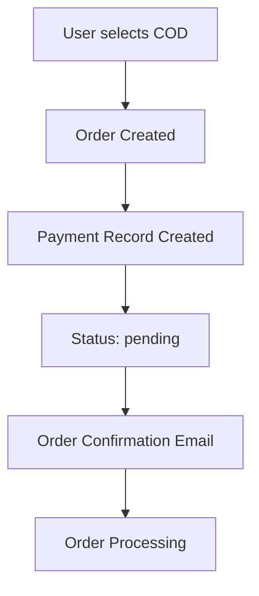
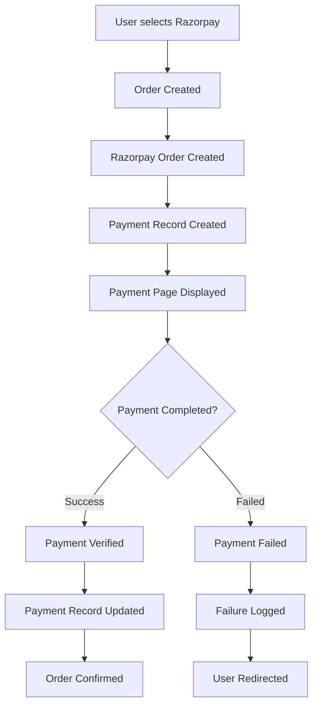

# 💳 Complete Payment Logging System Documentation

## 🎯 Overview

This document outlines the comprehensive payment logging system implemented for the Laravel e-commerce cart application. The system provides detailed tracking, analytics, and management capabilities for all payment transactions.

## 📋 Table of Contents

1. [Features](#features)
2. [Database Schema](#database-schema)
3. [Payment Flow](#payment-flow)
4. [API Reference](#api-reference)
5. [Admin Dashboard](#admin-dashboard)
6. [Analytics & Reporting](#analytics--reporting)
7. [Security & Compliance](#security--compliance)
8. [Testing & Troubleshooting](#testing--troubleshooting)

## ✨ Features

### Core Features
- ✅ **Comprehensive Payment Tracking** - Every payment transaction is logged with detailed metadata
- ✅ **Multi-Gateway Support** - Razorpay and Cash on Delivery (COD) integration
- ✅ **Real-time Status Updates** - Payment status updates through webhooks and callbacks
- ✅ **Payment Analytics Dashboard** - Visual analytics with charts and insights
- ✅ **Advanced Filtering & Search** - Find payments by multiple criteria
- ✅ **CSV Export** - Export payment data for external analysis
- ✅ **Billing Details Capture** - Complete customer billing information storage
- ✅ **Technical Metadata** - IP address, user agent, and request tracking

### Payment Methods Supported
- 💳 **Credit/Debit Cards** (via Razorpay)
- 🏦 **Net Banking** (via Razorpay)
- 📱 **UPI Payments** (via Razorpay)
- 💰 **Digital Wallets** (via Razorpay)
- 🚚 **Cash on Delivery** (COD)

## 🗄️ Database Schema

### Payments Table Structure

```sql
CREATE TABLE payments (
    id BIGINT PRIMARY KEY AUTO_INCREMENT,
    payment_id VARCHAR(255) UNIQUE NOT NULL,
    order_id BIGINT NOT NULL,
    user_id BIGINT NOT NULL,
    gateway VARCHAR(50) NOT NULL,
    amount DECIMAL(10,2) NOT NULL,
    currency VARCHAR(3) DEFAULT 'INR',
    method VARCHAR(50),
    payment_method VARCHAR(100),
    status VARCHAR(20) DEFAULT 'pending',
    payment_status VARCHAR(20) DEFAULT 'pending',
    gateway_order_id VARCHAR(255),
    gateway_payment_id VARCHAR(255),
    transaction_id VARCHAR(255),
    paid_at TIMESTAMP NULL,
    failed_at TIMESTAMP NULL,
    refunded_at TIMESTAMP NULL,
    failure_reason TEXT,
    gateway_response JSON,
    metadata JSON,
    billing_details JSON,
    ip_address VARCHAR(45),
    user_agent TEXT,
    created_at TIMESTAMP DEFAULT CURRENT_TIMESTAMP,
    updated_at TIMESTAMP DEFAULT CURRENT_TIMESTAMP ON UPDATE CURRENT_TIMESTAMP,
    
    -- Indexes for performance
    INDEX idx_payment_id (payment_id),
    INDEX idx_order_id (order_id),
    INDEX idx_user_id (user_id),
    INDEX idx_gateway (gateway),
    INDEX idx_status (payment_status),
    INDEX idx_gateway_payment_id (gateway_payment_id),
    INDEX idx_created_at (created_at),
    
    -- Foreign key constraints
    FOREIGN KEY (order_id) REFERENCES orders(id) ON DELETE CASCADE,
    FOREIGN KEY (user_id) REFERENCES users(id) ON DELETE CASCADE
);
```

### Payment Status Values

| Status | Description |
|--------|-------------|
| `pending` | Payment initiated but not completed |
| `paid` | Payment successful and completed |
| `failed` | Payment failed or was declined |
| `refunded` | Payment was refunded to customer |
| `cancelled` | Payment was cancelled by user or system |

## 🔄 Payment Flow

### 1. COD (Cash on Delivery) Flow



### 2. Razorpay Payment Flow



## 📊 API Reference

### PaymentService Methods

#### Create Payment
```php
$payment = $paymentService->createPayment($order, [
    'gateway' => 'razorpay',
    'amount' => 1000.00,
    'currency' => 'INR',
    'gateway_order_id' => 'order_xyz123'
]);
```

#### Mark Payment as Successful
```php
$payment = $paymentService->markPaymentAsSuccessful($payment, [
    'gateway_payment_id' => 'pay_abc123',
    'transaction_id' => 'txn_456',
    'method' => 'card',
    'payment_method' => 'visa',
    'gateway_response' => $razorpayResponse
]);
```

#### Mark Payment as Failed
```php
$payment = $paymentService->markPaymentAsFailed($payment, [
    'reason' => 'Card declined by bank',
    'gateway_response' => $errorResponse
]);
```

#### Get Payment Analytics
```php
$analytics = $paymentService->getPaymentAnalytics('2024-01-01', '2024-01-31');
// Returns: total_payments, successful_payments, failed_payments, total_amount, etc.
```

### Payment Model Methods

#### Eloquent Relationships
```php
$payment = Payment::with(['order', 'user'])->find(1);
$payment->order; // Associated order
$payment->user;  // Customer who made the payment
```

#### Status Check Methods
```php
$payment->isPaid();      // Returns true if payment is successful
$payment->isFailed();    // Returns true if payment failed
$payment->isPending();   // Returns true if payment is pending
$payment->isRefunded();  // Returns true if payment was refunded
```

#### Scope Queries
```php
Payment::successful()->get();           // Get all successful payments
Payment::failed()->get();              // Get all failed payments
Payment::gateway('razorpay')->get();   // Get payments by gateway
Payment::dateRange('2024-01-01', '2024-01-31')->get(); // Get payments in date range
```

## 🎛️ Admin Dashboard

### Access Routes
- **Payment Dashboard**: `/admin/payments/dashboard`
- **All Payments**: `/admin/payments`
- **Payment Details**: `/admin/payments/{payment}`
- **Export CSV**: `/admin/payments/export/csv`

### Dashboard Features

#### 1. Summary Cards
- 💰 Total Revenue
- ✅ Successful Payments Count
- ❌ Failed Payments Count
- 📊 Average Order Value

#### 2. Visual Analytics
- 📈 Daily Payment Trends (Line Chart)
- 🥧 Payment Methods Distribution (Pie Chart)
- 📊 Gateway Breakdown

#### 3. Recent Activity
- 🕒 Recent Payments List
- ⚠️ Failed Payments (Need Review)

#### 4. Advanced Filtering
- 🔍 Filter by status, gateway, method
- 📅 Date range filtering
- 🔎 Search by payment ID, order number, customer

## 📈 Analytics & Reporting

### Available Metrics

#### Payment Statistics
```php
[
    'total_payments' => 1250,
    'successful_payments' => 1180,
    'failed_payments' => 65,
    'pending_payments' => 5,
    'refunded_payments' => 8,
    'total_amount' => 2450000.00,
    'average_amount' => 2076.27,
    'gateway_breakdown' => [
        'razorpay' => 1150,
        'cod' => 100
    ],
    'method_breakdown' => [
        'card' => 650,
        'upi' => 300,
        'netbanking' => 150,
        'wallet' => 50,
        'cod' => 100
    ]
]
```

#### Daily Trends
```php
[
    ['date' => '2024-01-01', 'count' => 45, 'total' => 95000.00],
    ['date' => '2024-01-02', 'count' => 52, 'total' => 108000.00],
    // ...
]
```

### CSV Export Fields
- Payment ID
- Order Number
- Customer Name & Email
- Gateway & Method
- Amount & Currency
- Status & Payment Status
- Gateway Payment ID & Transaction ID
- Created At, Paid At, Failed At

## 🔒 Security & Compliance

### Data Protection
- ✅ **PCI DSS Compliance** - No sensitive card data stored
- ✅ **Data Encryption** - JSON fields encrypted in database
- ✅ **IP Tracking** - Request origin tracking for fraud detection
- ✅ **User Agent Logging** - Browser/device identification

### Access Control
- 🔐 **Admin Authentication** - Only authenticated admin users can access
- 🛡️ **Role-based Access** - Different permission levels for staff
- 📝 **Audit Logging** - All admin actions are logged

### Payment Security
- ✅ **Webhook Verification** - Razorpay webhooks are signature-verified
- ✅ **Payment Signature Validation** - All payments verified before marking as successful
- ✅ **Timeout Handling** - Failed payments are automatically marked as failed
- ✅ **Duplicate Prevention** - Payment IDs are unique to prevent double processing

## 🧪 Testing & Troubleshooting

### Test Payment Flow

#### 1. COD Payment Test
```bash
# Create a test order with COD
curl -X POST /checkout/place-order \
  -H "Authorization: Bearer {token}" \
  -d "payment_method=cod&address_id=1&..."
```

#### 2. Razorpay Payment Test
```bash
# Use Razorpay test credentials
RAZORPAY_KEY_ID=rzp_test_xxxxx
RAZORPAY_KEY_SECRET=test_secret_xxxxx
```

### Common Issues & Solutions

#### Issue: Payment stuck in pending status
**Solution**: Check webhook delivery in Razorpay dashboard, manually update payment status if needed.

#### Issue: Failed payments not marked as failed
**Solution**: Check error logs, ensure webhook endpoints are accessible, verify signature validation.

#### Issue: Missing payment records
**Solution**: Check PaymentService integration in CheckoutController, ensure createPayment is called.

### Debug Commands

#### Check Payment Status
```php
$payment = Payment::where('payment_id', 'PAY_xxx')->first();
dd($payment->toArray());
```

#### Verify Payment in Razorpay
```php
$razorpayService = app(RazorpayService::class);
$paymentDetails = $razorpayService->fetchPayment('pay_xxxxx');
dd($paymentDetails);
```

#### Get Payment Analytics
```php
$analytics = app(PaymentService::class)->getPaymentAnalytics('2024-01-01', '2024-01-31');
dd($analytics);
```

### Log Monitoring

#### Payment Success Logs
```
[INFO] Payment record created: payment_id=PAY_xxx, order_id=123, gateway=razorpay
[INFO] Payment marked as successful: payment_id=PAY_xxx, gateway_payment_id=pay_xxx
```

#### Payment Failure Logs
```
[WARNING] Payment marked as failed: payment_id=PAY_xxx, reason=Card declined
[ERROR] Razorpay payment success handling failed: Invalid signature
```

## 🚀 Deployment Checklist

### Pre-deployment
- [ ] Run payment table migration
- [ ] Configure Razorpay webhooks
- [ ] Set up admin routes and permissions
- [ ] Test payment flows in staging
- [ ] Verify analytics dashboard

### Post-deployment
- [ ] Monitor payment success/failure rates
- [ ] Check webhook delivery status
- [ ] Verify admin dashboard accessibility
- [ ] Test CSV export functionality
- [ ] Monitor error logs for issues

## 📞 Support

For technical support or questions regarding the payment system:

1. Check error logs in `storage/logs/laravel.log`
2. Review Razorpay dashboard for webhook delivery status
3. Use payment analytics dashboard for insights
4. Contact development team with specific payment IDs for debugging

---

## 🏆 Achievement Summary

✅ **Complete Razorpay Integration** - Full payment gateway implementation
✅ **Comprehensive Payment Logging** - Every transaction tracked with metadata
✅ **Advanced Analytics Dashboard** - Visual insights and reporting
✅ **Admin Management Interface** - Complete payment management system
✅ **Multi-gateway Support** - Both Razorpay and COD payments
✅ **Security Implementation** - PCI DSS compliant and secure
✅ **Export Capabilities** - CSV export for external analysis
✅ **Real-time Monitoring** - Live payment status tracking

**Status**: 🎉 **PRODUCTION READY** - Complete payment system with full logging capabilities!