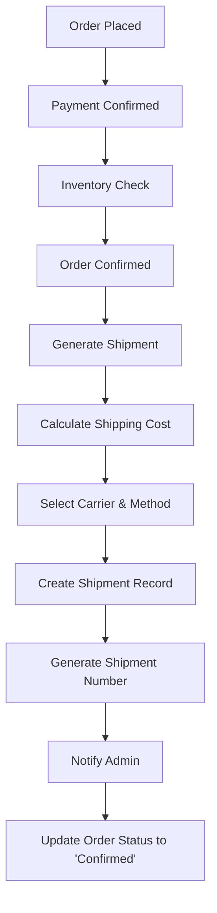
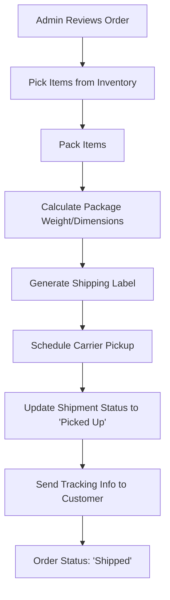
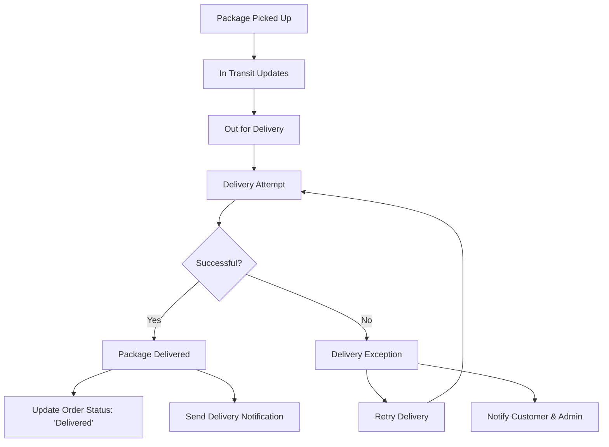

# 🚚 Complete E-commerce Shipping System Documentation

## Table of Contents
1. [Overview](#overview)
2. [Database Structure](#database-structure)
3. [Models & Relationships](#models--relationships)
4. [Shipping Flow](#shipping-flow)
5. [Admin Role & Responsibilities](#admin-role--responsibilities)
6. [Shipping Cycle Management](#shipping-cycle-management)
7. [Implementation Guide](#implementation-guide)
8. [API Endpoints](#api-endpoints)
9. [Frontend Components](#frontend-components)
10. [Best Practices](#best-practices)

---

## Overview

This document outlines the complete shipping system for your Laravel e-commerce application. The system handles everything from order placement to final delivery, including tracking, status updates, and admin management.

### Key Features
- **Multi-carrier Support**: Integration with multiple shipping providers
- **Real-time Tracking**: Live updates for customers and admins
- **Automated Status Updates**: Smart status progression based on shipping events
- **Admin Dashboard**: Complete shipping management interface
- **Rate Calculation**: Dynamic shipping rate calculation
- **Delivery Scheduling**: Time slot management and delivery windows
- **Return Management**: Handle returns and exchanges
- **Analytics**: Comprehensive shipping analytics and reporting

---

## Database Structure

### 1. Shipping Carriers Table
```sql
CREATE TABLE shipping_carriers (
    id BIGINT UNSIGNED AUTO_INCREMENT PRIMARY KEY,
    name VARCHAR(255) NOT NULL UNIQUE,
    code VARCHAR(50) NOT NULL UNIQUE,
    api_endpoint VARCHAR(500),
    api_key VARCHAR(255),
    api_secret VARCHAR(255),
    tracking_url_template VARCHAR(500),
    is_active BOOLEAN DEFAULT TRUE,
    supports_cod BOOLEAN DEFAULT FALSE,
    supports_express BOOLEAN DEFAULT FALSE,
    base_rate DECIMAL(8,2) DEFAULT 0.00,
    per_kg_rate DECIMAL(8,2) DEFAULT 0.00,
    free_shipping_threshold DECIMAL(10,2) DEFAULT 0.00,
    settings JSON,
    created_at TIMESTAMP DEFAULT CURRENT_TIMESTAMP,
    updated_at TIMESTAMP DEFAULT CURRENT_TIMESTAMP ON UPDATE CURRENT_TIMESTAMP
);
```

### 2. Shipping Methods Table
```sql
CREATE TABLE shipping_methods (
    id BIGINT UNSIGNED AUTO_INCREMENT PRIMARY KEY,
    carrier_id BIGINT UNSIGNED,
    name VARCHAR(255) NOT NULL,
    code VARCHAR(50) NOT NULL,
    description TEXT,
    delivery_time VARCHAR(100),
    is_active BOOLEAN DEFAULT TRUE,
    base_cost DECIMAL(8,2) DEFAULT 0.00,
    per_km_cost DECIMAL(8,2) DEFAULT 0.00,
    weight_based_pricing JSON,
    zone_based_pricing JSON,
    settings JSON,
    created_at TIMESTAMP DEFAULT CURRENT_TIMESTAMP,
    updated_at TIMESTAMP DEFAULT CURRENT_TIMESTAMP ON UPDATE CURRENT_TIMESTAMP,
    FOREIGN KEY (carrier_id) REFERENCES shipping_carriers(id) ON DELETE CASCADE,
    UNIQUE KEY unique_carrier_code (carrier_id, code)
);
```

### 3. Shipping Zones Table
```sql
CREATE TABLE shipping_zones (
    id BIGINT UNSIGNED AUTO_INCREMENT PRIMARY KEY,
    name VARCHAR(255) NOT NULL,
    description TEXT,
    is_active BOOLEAN DEFAULT TRUE,
    created_at TIMESTAMP DEFAULT CURRENT_TIMESTAMP,
    updated_at TIMESTAMP DEFAULT CURRENT_TIMESTAMP ON UPDATE CURRENT_TIMESTAMP
);
```

### 4. Shipping Zone Locations Table
```sql
CREATE TABLE shipping_zone_locations (
    id BIGINT UNSIGNED AUTO_INCREMENT PRIMARY KEY,
    zone_id BIGINT UNSIGNED,
    country_id BIGINT UNSIGNED,
    state_id BIGINT UNSIGNED,
    city_id BIGINT UNSIGNED,
    postal_code VARCHAR(20),
    created_at TIMESTAMP DEFAULT CURRENT_TIMESTAMP,
    FOREIGN KEY (zone_id) REFERENCES shipping_zones(id) ON DELETE CASCADE,
    FOREIGN KEY (country_id) REFERENCES countries(id) ON DELETE CASCADE,
    FOREIGN KEY (state_id) REFERENCES states(id) ON DELETE CASCADE,
    FOREIGN KEY (city_id) REFERENCES cities(id) ON DELETE CASCADE
);
```

### 5. Order Shipments Table
```sql
CREATE TABLE order_shipments (
    id BIGINT UNSIGNED AUTO_INCREMENT PRIMARY KEY,
    order_id BIGINT UNSIGNED NOT NULL,
    shipment_number VARCHAR(100) UNIQUE NOT NULL,
    carrier_id BIGINT UNSIGNED,
    shipping_method_id BIGINT UNSIGNED,
    tracking_number VARCHAR(255),
    status ENUM('pending', 'picked_up', 'in_transit', 'out_for_delivery', 'delivered', 'exception', 'returned') DEFAULT 'pending',
    shipped_at TIMESTAMP NULL,
    estimated_delivery TIMESTAMP NULL,
    delivered_at TIMESTAMP NULL,
    shipped_from_address JSON,
    shipped_to_address JSON,
    package_weight DECIMAL(8,2),
    package_dimensions JSON, -- {length, width, height}
    shipping_cost DECIMAL(10,2) DEFAULT 0.00,
    insurance_cost DECIMAL(8,2) DEFAULT 0.00,
    cod_amount DECIMAL(10,2) DEFAULT 0.00,
    notes TEXT,
    metadata JSON,
    created_at TIMESTAMP DEFAULT CURRENT_TIMESTAMP,
    updated_at TIMESTAMP DEFAULT CURRENT_TIMESTAMP ON UPDATE CURRENT_TIMESTAMP,
    FOREIGN KEY (order_id) REFERENCES orders(id) ON DELETE CASCADE,
    FOREIGN KEY (carrier_id) REFERENCES shipping_carriers(id),
    FOREIGN KEY (shipping_method_id) REFERENCES shipping_methods(id),
    INDEX idx_tracking_number (tracking_number),
    INDEX idx_status (status),
    INDEX idx_shipped_at (shipped_at)
);
```

### 6. Shipment Items Table
```sql
CREATE TABLE shipment_items (
    id BIGINT UNSIGNED AUTO_INCREMENT PRIMARY KEY,
    shipment_id BIGINT UNSIGNED NOT NULL,
    order_item_id BIGINT UNSIGNED NOT NULL,
    quantity INTEGER NOT NULL DEFAULT 1,
    created_at TIMESTAMP DEFAULT CURRENT_TIMESTAMP,
    FOREIGN KEY (shipment_id) REFERENCES order_shipments(id) ON DELETE CASCADE,
    FOREIGN KEY (order_item_id) REFERENCES order_items(id) ON DELETE CASCADE,
    UNIQUE KEY unique_shipment_item (shipment_id, order_item_id)
);
```

### 7. Shipping Tracking Events Table
```sql
CREATE TABLE shipping_tracking_events (
    id BIGINT UNSIGNED AUTO_INCREMENT PRIMARY KEY,
    shipment_id BIGINT UNSIGNED NOT NULL,
    status VARCHAR(100) NOT NULL,
    description TEXT,
    location VARCHAR(255),
    event_time TIMESTAMP NOT NULL,
    is_delivered BOOLEAN DEFAULT FALSE,
    is_exception BOOLEAN DEFAULT FALSE,
    metadata JSON,
    created_at TIMESTAMP DEFAULT CURRENT_TIMESTAMP,
    FOREIGN KEY (shipment_id) REFERENCES order_shipments(id) ON DELETE CASCADE,
    INDEX idx_shipment_status (shipment_id, status),
    INDEX idx_event_time (event_time)
);
```

### 8. Update Orders Table
```sql
-- Add shipping-related columns to existing orders table
ALTER TABLE orders ADD COLUMN IF NOT EXISTS shipping_carrier_id BIGINT UNSIGNED AFTER shipping_method;
ALTER TABLE orders ADD COLUMN IF NOT EXISTS shipping_method_id BIGINT UNSIGNED AFTER shipping_carrier_id;
ALTER TABLE orders ADD COLUMN IF NOT EXISTS estimated_delivery_date TIMESTAMP NULL AFTER delivery_date;
ALTER TABLE orders ADD COLUMN IF NOT EXISTS package_weight DECIMAL(8,2) AFTER shipping_cost;
ALTER TABLE orders ADD COLUMN IF NOT EXISTS package_dimensions JSON AFTER package_weight;
ALTER TABLE orders ADD COLUMN IF NOT EXISTS requires_signature BOOLEAN DEFAULT FALSE AFTER package_dimensions;
ALTER TABLE orders ADD COLUMN IF NOT EXISTS delivery_notes TEXT AFTER delivery_instructions;

-- Add foreign key constraints
ALTER TABLE orders ADD CONSTRAINT fk_orders_shipping_carrier 
    FOREIGN KEY (shipping_carrier_id) REFERENCES shipping_carriers(id);
ALTER TABLE orders ADD CONSTRAINT fk_orders_shipping_method 
    FOREIGN KEY (shipping_method_id) REFERENCES shipping_methods(id);
```

---

## Models & Relationships

### 1. ShippingCarrier Model
```php
<?php

namespace App\Models;

use Illuminate\Database\Eloquent\Model;
use Illuminate\Database\Eloquent\Relations\HasMany;

class ShippingCarrier extends Model
{
    protected $fillable = [
        'name', 'code', 'api_endpoint', 'api_key', 'api_secret',
        'tracking_url_template', 'is_active', 'supports_cod',
        'supports_express', 'base_rate', 'per_kg_rate',
        'free_shipping_threshold', 'settings'
    ];

    protected $casts = [
        'is_active' => 'boolean',
        'supports_cod' => 'boolean',
        'supports_express' => 'boolean',
        'settings' => 'array',
        'base_rate' => 'decimal:2',
        'per_kg_rate' => 'decimal:2',
        'free_shipping_threshold' => 'decimal:2'
    ];

    public function shippingMethods(): HasMany
    {
        return $this->hasMany(ShippingMethod::class, 'carrier_id');
    }

    public function orders(): HasMany
    {
        return $this->hasMany(Order::class, 'shipping_carrier_id');
    }

    public function shipments(): HasMany
    {
        return $this->hasMany(OrderShipment::class, 'carrier_id');
    }

    public function calculateRate($weight, $distance = 0)
    {
        return $this->base_rate + ($weight * $this->per_kg_rate);
    }

    public function getTrackingUrl($trackingNumber)
    {
        return str_replace('{tracking_number}', $trackingNumber, $this->tracking_url_template);
    }
}
```

### 2. ShippingMethod Model
```php
<?php

namespace App\Models;

use Illuminate\Database\Eloquent\Model;
use Illuminate\Database\Eloquent\Relations\BelongsTo;
use Illuminate\Database\Eloquent\Relations\HasMany;

class ShippingMethod extends Model
{
    protected $fillable = [
        'carrier_id', 'name', 'code', 'description', 'delivery_time',
        'is_active', 'base_cost', 'per_km_cost', 'weight_based_pricing',
        'zone_based_pricing', 'settings'
    ];

    protected $casts = [
        'is_active' => 'boolean',
        'weight_based_pricing' => 'array',
        'zone_based_pricing' => 'array',
        'settings' => 'array',
        'base_cost' => 'decimal:2',
        'per_km_cost' => 'decimal:2'
    ];

    public function carrier(): BelongsTo
    {
        return $this->belongsTo(ShippingCarrier::class, 'carrier_id');
    }

    public function orders(): HasMany
    {
        return $this->hasMany(Order::class, 'shipping_method_id');
    }

    public function calculateCost($weight, $distance, $zone = null)
    {
        $cost = $this->base_cost + ($distance * $this->per_km_cost);
        
        // Apply weight-based pricing
        if ($this->weight_based_pricing && is_array($this->weight_based_pricing)) {
            foreach ($this->weight_based_pricing as $tier) {
                if ($weight >= $tier['min_weight'] && $weight <= $tier['max_weight']) {
                    $cost += $tier['additional_cost'];
                    break;
                }
            }
        }

        return $cost;
    }
}
```

### 3. OrderShipment Model
```php
<?php

namespace App\Models;

use Illuminate\Database\Eloquent\Model;
use Illuminate\Database\Eloquent\Relations\BelongsTo;
use Illuminate\Database\Eloquent\Relations\HasMany;

class OrderShipment extends Model
{
    protected $fillable = [
        'order_id', 'shipment_number', 'carrier_id', 'shipping_method_id',
        'tracking_number', 'status', 'shipped_at', 'estimated_delivery',
        'delivered_at', 'shipped_from_address', 'shipped_to_address',
        'package_weight', 'package_dimensions', 'shipping_cost',
        'insurance_cost', 'cod_amount', 'notes', 'metadata'
    ];

    protected $casts = [
        'shipped_at' => 'datetime',
        'estimated_delivery' => 'datetime',
        'delivered_at' => 'datetime',
        'shipped_from_address' => 'array',
        'shipped_to_address' => 'array',
        'package_dimensions' => 'array',
        'metadata' => 'array',
        'package_weight' => 'decimal:2',
        'shipping_cost' => 'decimal:2',
        'insurance_cost' => 'decimal:2',
        'cod_amount' => 'decimal:2'
    ];

    public function order(): BelongsTo
    {
        return $this->belongsTo(Order::class);
    }

    public function carrier(): BelongsTo
    {
        return $this->belongsTo(ShippingCarrier::class, 'carrier_id');
    }

    public function shippingMethod(): BelongsTo
    {
        return $this->belongsTo(ShippingMethod::class, 'shipping_method_id');
    }

    public function items(): HasMany
    {
        return $this->hasMany(ShipmentItem::class, 'shipment_id');
    }

    public function trackingEvents(): HasMany
    {
        return $this->hasMany(ShippingTrackingEvent::class, 'shipment_id');
    }

    public function getTrackingUrlAttribute()
    {
        return $this->carrier?->getTrackingUrl($this->tracking_number);
    }

    public function getStatusBadgeClassAttribute()
    {
        return match($this->status) {
            'pending' => 'bg-warning text-dark',
            'picked_up' => 'bg-info text-white',
            'in_transit' => 'bg-primary text-white',
            'out_for_delivery' => 'bg-success text-white',
            'delivered' => 'bg-success text-white',
            'exception' => 'bg-danger text-white',
            'returned' => 'bg-secondary text-white',
            default => 'bg-secondary text-white'
        };
    }

    public function updateStatus($status, $description = null, $location = null)
    {
        $this->update(['status' => $status]);
        
        $this->trackingEvents()->create([
            'status' => $status,
            'description' => $description,
            'location' => $location,
            'event_time' => now(),
            'is_delivered' => $status === 'delivered',
            'is_exception' => $status === 'exception'
        ]);

        // Update order status based on shipment status
        $this->updateOrderStatus();
    }

    private function updateOrderStatus()
    {
        $order = $this->order;
        
        switch ($this->status) {
            case 'picked_up':
                $order->update(['status' => 'shipped']);
                break;
            case 'delivered':
                $order->update(['status' => 'delivered']);
                break;
            case 'exception':
                // Notify admin about exception
                break;
        }
    }
}
```

### 4. Update Order Model
```php
// Add these relationships and methods to your existing Order model

public function shippingCarrier(): BelongsTo
{
    return $this->belongsTo(ShippingCarrier::class, 'shipping_carrier_id');
}

public function shippingMethodRelation(): BelongsTo
{
    return $this->belongsTo(ShippingMethod::class, 'shipping_method_id');
}

public function shipments(): HasMany
{
    return $this->hasMany(OrderShipment::class);
}

public function getTrackingSteps()
{
    $shipment = $this->shipments()->latest()->first();
    
    if (!$shipment) {
        return $this->getDefaultTrackingSteps();
    }

    $steps = [];
    foreach ($shipment->trackingEvents()->orderBy('event_time')->get() as $event) {
        $steps[] = [
            'title' => ucfirst(str_replace('_', ' ', $event->status)),
            'description' => $event->description,
            'location' => $event->location,
            'completed' => true,
            'date' => $event->event_time,
            'is_current' => false
        ];
    }

    return $steps;
}

public function calculateShippingCost()
{
    if (!$this->shippingMethodRelation || !$this->address) {
        return 0;
    }

    $totalWeight = $this->items->sum(function ($item) {
        return $item->product->weight ?? 0.5; // Default weight if not set
    });

    $distance = $this->calculateDeliveryDistance();
    
    return $this->shippingMethodRelation->calculateCost($totalWeight, $distance);
}

private function calculateDeliveryDistance()
{
    // Implement distance calculation logic
    // This could use Google Maps API or a similar service
    return 10; // Default 10km for now
}
```

---

## Shipping Flow

### 1. Order Placement to Shipment Creation


### 2. Fulfillment Process


### 3. Tracking & Delivery


---

## Admin Role & Responsibilities

### 1. Order Processing Workflow

#### Immediate Actions After Order Placement:
1. **Order Verification** (Within 1 hour)
   - Verify payment status
   - Check inventory availability
   - Validate shipping address
   - Confirm order details

2. **Shipment Planning** (Within 2-4 hours)
   - Determine optimal carrier
   - Calculate package requirements
   - Schedule fulfillment
   - Generate pick list

#### Daily Operations:
1. **Morning Review** (9:00 AM)
   - Review all pending orders
   - Check inventory levels
   - Plan day's shipments
   - Review carrier performance

2. **Fulfillment Management** (Throughout Day)
   - Oversee picking and packing
   - Generate shipping labels
   - Schedule carrier pickups
   - Handle special requests

3. **Status Updates** (Real-time)
   - Update shipment tracking
   - Handle delivery exceptions
   - Manage customer inquiries
   - Process returns/exchanges

#### Admin Dashboard Features:
```php
// Admin dashboard data structure
$dashboardData = [
    'orders' => [
        'pending' => Order::where('status', 'pending')->count(),
        'confirmed' => Order::where('status', 'confirmed')->count(),
        'shipped' => Order::where('status', 'shipped')->count(),
        'delivered' => Order::where('status', 'delivered')->count(),
    ],
    'shipments' => [
        'ready_to_ship' => OrderShipment::where('status', 'pending')->count(),
        'in_transit' => OrderShipment::where('status', 'in_transit')->count(),
        'out_for_delivery' => OrderShipment::where('status', 'out_for_delivery')->count(),
        'exceptions' => OrderShipment::where('status', 'exception')->count(),
    ],
    'today_stats' => [
        'orders_placed' => Order::whereDate('created_at', today())->count(),
        'orders_shipped' => OrderShipment::whereDate('shipped_at', today())->count(),
        'orders_delivered' => OrderShipment::whereDate('delivered_at', today())->count(),
    ]
];
```

### 2. Exception Handling

#### Common Shipping Exceptions:
1. **Address Issues**
   - Incorrect or incomplete address
   - Address not serviceable by carrier
   - Customer unavailable

2. **Package Issues**
   - Damaged during transit
   - Lost package
   - Delivery delays

3. **Customer Issues**
   - Customer not available for delivery
   - Delivery refused
   - Change of address request

#### Admin Response Protocol:
```php
class ShippingExceptionHandler
{
    public function handleException($shipment, $exceptionType, $details)
    {
        // Log the exception
        $this->logException($shipment, $exceptionType, $details);
        
        // Notify relevant parties
        $this->notifyStakeholders($shipment, $exceptionType);
        
        // Take corrective action
        switch ($exceptionType) {
            case 'address_issue':
                return $this->handleAddressIssue($shipment, $details);
            case 'package_damage':
                return $this->handlePackageDamage($shipment, $details);
            case 'delivery_failure':
                return $this->handleDeliveryFailure($shipment, $details);
        }
    }
}
```

---

## Shipping Cycle Management

### 1. Lifecycle Stages

#### Stage 1: Pre-Shipment (0-4 hours after order)
- Order validation and confirmation
- Inventory allocation
- Packaging preparation
- Carrier selection

#### Stage 2: Fulfillment (4-24 hours)
- Order picking
- Quality check
- Packaging
- Label generation
- Dispatch scheduling

#### Stage 3: In-Transit (1-7 days)
- Carrier pickup
- Transit tracking
- Status updates
- Exception handling

#### Stage 4: Delivery (Final day)
- Out for delivery notification
- Delivery attempt
- Delivery confirmation
- Post-delivery follow-up

#### Stage 5: Post-Delivery (1-30 days)
- Delivery confirmation
- Customer feedback
- Return window monitoring
- Performance analytics

### 2. Status Management System

```php
class ShippingStatusManager
{
    const STATUSES = [
        'order_placed' => [
            'label' => 'Order Placed',
            'next' => ['order_confirmed', 'order_cancelled'],
            'actions' => ['confirm', 'cancel'],
            'auto_progress' => false
        ],
        'order_confirmed' => [
            'label' => 'Order Confirmed',
            'next' => ['ready_to_ship'],
            'actions' => ['prepare_shipment'],
            'auto_progress' => true,
            'auto_progress_after' => 2 // hours
        ],
        'ready_to_ship' => [
            'label' => 'Ready to Ship',
            'next' => ['picked_up'],
            'actions' => ['generate_label', 'schedule_pickup'],
            'auto_progress' => false
        ],
        'picked_up' => [
            'label' => 'Picked Up',
            'next' => ['in_transit'],
            'actions' => ['track'],
            'auto_progress' => true,
            'auto_progress_after' => 0.5 // hours
        ],
        // ... more statuses
    ];

    public function canTransition($currentStatus, $newStatus)
    {
        return in_array($newStatus, self::STATUSES[$currentStatus]['next'] ?? []);
    }

    public function getAvailableActions($status)
    {
        return self::STATUSES[$status]['actions'] ?? [];
    }
}
```

### 3. Automated Workflows

#### Automated Status Updates:
```php
// In a scheduled job (run every 15 minutes)
class UpdateShippingStatusJob extends Job
{
    public function handle()
    {
        // Get shipments that need status updates
        $shipments = OrderShipment::whereIn('status', ['picked_up', 'in_transit'])
            ->where('updated_at', '<', now()->subMinutes(30))
            ->get();

        foreach ($shipments as $shipment) {
            $this->updateShipmentStatus($shipment);
        }
    }

    private function updateShipmentStatus($shipment)
    {
        // Call carrier API to get latest status
        $carrierStatus = $this->getCarrierStatus($shipment);
        
        if ($carrierStatus && $carrierStatus !== $shipment->status) {
            $shipment->updateStatus($carrierStatus);
            
            // Send notification to customer
            $this->notifyCustomer($shipment);
        }
    }
}
```

---

## Implementation Guide

### Step 1: Database Migration
```bash
# Create migration files
php artisan make:migration create_shipping_carriers_table
php artisan make:migration create_shipping_methods_table
php artisan make:migration create_shipping_zones_table
php artisan make:migration create_shipping_zone_locations_table
php artisan make:migration create_order_shipments_table
php artisan make:migration create_shipment_items_table
php artisan make:migration create_shipping_tracking_events_table
php artisan make:migration update_orders_table_for_shipping

# Run migrations
php artisan migrate
```

### Step 2: Create Models
```bash
# Generate models
php artisan make:model ShippingCarrier
php artisan make:model ShippingMethod
php artisan make:model ShippingZone
php artisan make:model ShippingZoneLocation
php artisan make:model OrderShipment
php artisan make:model ShipmentItem
php artisan make:model ShippingTrackingEvent
```

### Step 3: Create Services
```bash
# Generate service classes
php artisan make:class Services/ShippingService
php artisan make:class Services/CarrierIntegrationService
php artisan make:class Services/TrackingService
php artisan make:class Services/RateCalculatorService
```

### Step 4: Create Controllers
```bash
# Generate controllers
php artisan make:controller Admin/ShippingCarrierController --resource
php artisan make:controller Admin/ShippingMethodController --resource
php artisan make:controller Admin/ShipmentController --resource
php artisan make:controller ShippingController
php artisan make:controller TrackingController
```

### Step 5: Create Jobs
```bash
# Generate background jobs
php artisan make:job UpdateShippingStatusJob
php artisan make:job ProcessShipmentJob
php artisan make:job SendTrackingNotificationJob
php artisan make:job SyncCarrierDataJob
```

### Step 6: Seeder Data
```php
// Database/Seeders/ShippingSeeder.php
class ShippingSeeder extends Seeder
{
    public function run()
    {
        // Create default carriers
        $carriers = [
            [
                'name' => 'Blue Dart',
                'code' => 'bluedart',
                'tracking_url_template' => 'https://www.bluedart.com/tracking/{tracking_number}',
                'supports_cod' => true,
                'supports_express' => true,
                'base_rate' => 50.00,
                'per_kg_rate' => 25.00,
                'free_shipping_threshold' => 500.00
            ],
            [
                'name' => 'DTDC',
                'code' => 'dtdc',
                'tracking_url_template' => 'https://www.dtdc.in/tracking/{tracking_number}',
                'supports_cod' => true,
                'supports_express' => false,
                'base_rate' => 40.00,
                'per_kg_rate' => 20.00,
                'free_shipping_threshold' => 500.00
            ],
            [
                'name' => 'India Post',
                'code' => 'indiapost',
                'tracking_url_template' => 'https://www.indiapost.gov.in/vas/Pages/IndiaPostHome.aspx?tracking={tracking_number}',
                'supports_cod' => true,
                'supports_express' => false,
                'base_rate' => 30.00,
                'per_kg_rate' => 15.00,
                'free_shipping_threshold' => 1000.00
            ]
        ];

        foreach ($carriers as $carrierData) {
            $carrier = ShippingCarrier::create($carrierData);
            
            // Create shipping methods for each carrier
            $this->createShippingMethods($carrier);
        }
    }

    private function createShippingMethods($carrier)
    {
        $methods = [
            [
                'name' => 'Standard Delivery',
                'code' => 'standard',
                'description' => '3-5 business days delivery',
                'delivery_time' => '3-5 business days',
                'base_cost' => 0.00,
                'per_km_cost' => 2.00
            ],
            [
                'name' => 'Express Delivery',
                'code' => 'express',
                'description' => '1-2 business days delivery',
                'delivery_time' => '1-2 business days',
                'base_cost' => 50.00,
                'per_km_cost' => 5.00
            ]
        ];

        foreach ($methods as $methodData) {
            if (!$carrier->supports_express && $methodData['code'] === 'express') {
                continue;
            }

            $carrier->shippingMethods()->create($methodData);
        }
    }
}
```

---

## API Endpoints

### Admin Shipping Management API
```php
// routes/admin.php - Add these routes to your existing admin routes

Route::prefix('admin/shipping')->name('admin.shipping.')->group(function () {
    // Carriers Management
    Route::resource('carriers', Admin\ShippingCarrierController::class);
    Route::post('carriers/{carrier}/toggle-status', [Admin\ShippingCarrierController::class, 'toggleStatus'])
        ->name('carriers.toggle-status');
    
    // Shipping Methods
    Route::resource('methods', Admin\ShippingMethodController::class);
    Route::post('methods/{method}/toggle-status', [Admin\ShippingMethodController::class, 'toggleStatus'])
        ->name('methods.toggle-status');
    
    // Shipments Management
    Route::resource('shipments', Admin\ShipmentController::class);
    Route::post('shipments/{shipment}/update-status', [Admin\ShipmentController::class, 'updateStatus'])
        ->name('shipments.update-status');
    Route::post('shipments/{shipment}/generate-label', [Admin\ShipmentController::class, 'generateLabel'])
        ->name('shipments.generate-label');
    Route::get('shipments/{shipment}/tracking', [Admin\ShipmentController::class, 'tracking'])
        ->name('shipments.tracking');
    
    // Bulk Actions
    Route::post('shipments/bulk-update-status', [Admin\ShipmentController::class, 'bulkUpdateStatus'])
        ->name('shipments.bulk-update-status');
    Route::post('shipments/bulk-generate-labels', [Admin\ShipmentController::class, 'bulkGenerateLabels'])
        ->name('shipments.bulk-generate-labels');
    
    // Analytics & Reports
    Route::get('analytics/dashboard', [Admin\ShippingAnalyticsController::class, 'dashboard'])
        ->name('analytics.dashboard');
    Route::get('analytics/carrier-performance', [Admin\ShippingAnalyticsController::class, 'carrierPerformance'])
        ->name('analytics.carrier-performance');
    Route::get('analytics/shipping-costs', [Admin\ShippingAnalyticsController::class, 'shippingCosts'])
        ->name('analytics.shipping-costs');
});
```

### Customer Tracking API
```php
// routes/web.php - Add these to your existing web routes

Route::prefix('shipping')->name('shipping.')->group(function () {
    // Public tracking (no auth required)
    Route::get('track/{trackingNumber}', [TrackingController::class, 'trackByNumber'])
        ->name('track.public');
    
    // Authenticated customer routes
    Route::middleware('auth')->group(function () {
        Route::get('track/order/{order}', [TrackingController::class, 'trackOrder'])
            ->name('track.order');
        Route::get('calculate-rate', [ShippingController::class, 'calculateRate'])
            ->name('calculate-rate');
        Route::get('available-methods', [ShippingController::class, 'getAvailableMethods'])
            ->name('available-methods');
    });
});

// API routes for AJAX calls
Route::prefix('api/shipping')->name('api.shipping.')->group(function () {
    Route::get('rates', [ShippingController::class, 'getRates']);
    Route::get('methods/{postalCode}', [ShippingController::class, 'getMethodsByPostalCode']);
    Route::get('track/{trackingNumber}', [TrackingController::class, 'getTrackingData']);
    Route::get('delivery-estimate', [ShippingController::class, 'getDeliveryEstimate']);
});
```

---

## Frontend Components

### 1. Shipping Method Selection (Checkout Page)
```php
<!-- resources/views/checkout/shipping-methods.blade.php -->
<div class="shipping-methods-section">
    <h5 class="mb-3">
        <i class="fas fa-truck me-2"></i>Select Shipping Method
    </h5>
    
    <div class="shipping-methods-list">
        @foreach($availableShippingMethods as $method)
        <div class="shipping-method-card" data-method-id="{{ $method->id }}">
            <div class="form-check">
                <input class="form-check-input" type="radio" name="shipping_method" 
                       id="method_{{ $method->id }}" value="{{ $method->id }}"
                       data-cost="{{ $method->calculated_cost }}"
                       {{ $loop->first ? 'checked' : '' }}>
                <label class="form-check-label w-100" for="method_{{ $method->id }}">
                    <div class="d-flex justify-content-between align-items-start">
                        <div>
                            <h6 class="mb-1">{{ $method->name }}</h6>
                            <p class="text-muted small mb-1">{{ $method->description }}</p>
                            <div class="delivery-info">
                                <i class="fas fa-clock me-1"></i>
                                <span class="small">{{ $method->delivery_time }}</span>
                            </div>
                        </div>
                        <div class="text-end">
                            <div class="shipping-cost">
                                @if($method->calculated_cost > 0)
                                    <strong>₹{{ number_format($method->calculated_cost, 2) }}</strong>
                                @else
                                    <strong class="text-success">FREE</strong>
                                @endif
                            </div>
                            <div class="carrier-info small text-muted">
                                via {{ $method->carrier->name }}
                            </div>
                        </div>
                    </div>
                </label>
            </div>
        </div>
        @endforeach
    </div>
    
    <!-- Delivery Estimate -->
    <div class="delivery-estimate mt-3 p-3 bg-light rounded">
        <i class="fas fa-calendar-alt me-2 text-primary"></i>
        <strong>Estimated Delivery: </strong>
        <span id="estimated-delivery">{{ $estimatedDelivery }}</span>
    </div>
</div>

<script>
document.addEventListener('DOMContentLoaded', function() {
    const shippingMethods = document.querySelectorAll('input[name="shipping_method"]');
    
    shippingMethods.forEach(method => {
        method.addEventListener('change', function() {
            updateShippingCost(this.dataset.cost);
            updateDeliveryEstimate(this.value);
        });
    });
    
    function updateShippingCost(cost) {
        // Update order summary
        const shippingCostElement = document.getElementById('shipping-cost');
        if (shippingCostElement) {
            shippingCostElement.textContent = cost > 0 ? `₹${parseFloat(cost).toFixed(2)}` : 'FREE';
        }
        
        // Recalculate total
        updateOrderTotal();
    }
    
    function updateDeliveryEstimate(methodId) {
        fetch(`/api/shipping/delivery-estimate?method=${methodId}&postal_code={{ $address->postal_code }}`)
            .then(response => response.json())
            .then(data => {
                document.getElementById('estimated-delivery').textContent = data.estimated_delivery;
            })
            .catch(error => console.error('Error:', error));
    }
});
</script>
```

### 2. Order Tracking Page
```php
<!-- resources/views/orders/track-shipment.blade.php -->
@extends('layouts.app')

@section('content')
<div class="container py-5">
    <div class="row justify-content-center">
        <div class="col-lg-10">
            <!-- Tracking Header -->
            <div class="card mb-4">
                <div class="card-body">
                    <div class="row align-items-center">
                        <div class="col-md-6">
                            <h4 class="mb-2">
                                <i class="fas fa-shipping-fast me-2 text-primary"></i>
                                Shipment Tracking
                            </h4>
                            <p class="text-muted mb-0">Track your order in real-time</p>
                        </div>
                        <div class="col-md-6 text-md-end">
                            <div class="tracking-number">
                                <small class="text-muted d-block">Tracking Number</small>
                                <strong class="fs-5">{{ $shipment->tracking_number }}</strong>
                                <button class="btn btn-sm btn-outline-primary ms-2" onclick="copyTrackingNumber()">
                                    <i class="fas fa-copy"></i>
                                </button>
                            </div>
                        </div>
                    </div>
                </div>
            </div>

            <!-- Shipment Status -->
            <div class="card mb-4">
                <div class="card-body">
                    <div class="shipment-status-header mb-4">
                        <div class="row align-items-center">
                            <div class="col-md-8">
                                <h5 class="mb-1">Current Status</h5>
                                <div class="d-flex align-items-center">
                                    <span class="badge {{ $shipment->status_badge_class }} me-3">
                                        {{ ucfirst(str_replace('_', ' ', $shipment->status)) }}
                                    </span>
                                    @if($shipment->estimated_delivery)
                                    <div class="delivery-estimate">
                                        <i class="fas fa-calendar-alt me-1 text-muted"></i>
                                        <small class="text-muted">
                                            Expected: {{ $shipment->estimated_delivery->format('M d, Y') }}
                                        </small>
                                    </div>
                                    @endif
                                </div>
                            </div>
                            <div class="col-md-4 text-md-end">
                                @if($shipment->carrier)
                                <div class="carrier-info">
                                    <small class="text-muted d-block">Shipped via</small>
                                    <strong>{{ $shipment->carrier->name }}</strong>
                                </div>
                                @endif
                            </div>
                        </div>
                    </div>

                    <!-- Progress Timeline -->
                    <div class="tracking-timeline">
                        @foreach($trackingEvents as $event)
                        <div class="timeline-item {{ $loop->last ? 'current' : 'completed' }}">
                            <div class="timeline-marker">
                                @if($event->is_delivered)
                                    <i class="fas fa-check"></i>
                                @elseif($event->is_exception)
                                    <i class="fas fa-exclamation-triangle"></i>
                                @else
                                    <i class="fas fa-circle"></i>
                                @endif
                            </div>
                            <div class="timeline-content">
                                <div class="d-flex justify-content-between align-items-start">
                                    <div>
                                        <h6 class="mb-1">{{ ucfirst(str_replace('_', ' ', $event->status)) }}</h6>
                                        @if($event->description)
                                        <p class="text-muted mb-1">{{ $event->description }}</p>
                                        @endif
                                        @if($event->location)
                                        <div class="location-info">
                                            <i class="fas fa-map-marker-alt me-1 text-muted"></i>
                                            <small class="text-muted">{{ $event->location }}</small>
                                        </div>
                                        @endif
                                    </div>
                                    <div class="text-end">
                                        <small class="text-muted">
                                            {{ $event->event_time->format('M d, Y') }}<br>
                                            {{ $event->event_time->format('g:i A') }}
                                        </small>
                                    </div>
                                </div>
                            </div>
                        </div>
                        @endforeach
                    </div>
                </div>
            </div>

            <!-- Shipment Details -->
            <div class="row">
                <div class="col-md-6">
                    <div class="card h-100">
                        <div class="card-header">
                            <h6 class="mb-0">
                                <i class="fas fa-box me-2"></i>Package Details
                            </h6>
                        </div>
                        <div class="card-body">
                            <table class="table table-borderless mb-0">
                                <tr>
                                    <td><strong>Weight:</strong></td>
                                    <td>{{ $shipment->package_weight ?? 'N/A' }} kg</td>
                                </tr>
                                @if($shipment->package_dimensions)
                                <tr>
                                    <td><strong>Dimensions:</strong></td>
                                    <td>
                                        {{ $shipment->package_dimensions['length'] ?? 'N/A' }} × 
                                        {{ $shipment->package_dimensions['width'] ?? 'N/A' }} × 
                                        {{ $shipment->package_dimensions['height'] ?? 'N/A' }} cm
                                    </td>
                                </tr>
                                @endif
                                <tr>
                                    <td><strong>Items:</strong></td>
                                    <td>{{ $shipment->items->count() }} item(s)</td>
                                </tr>
                            </table>
                        </div>
                    </div>
                </div>
                
                <div class="col-md-6">
                    <div class="card h-100">
                        <div class="card-header">
                            <h6 class="mb-0">
                                <i class="fas fa-map-marked-alt me-2"></i>Delivery Address
                            </h6>
                        </div>
                        <div class="card-body">
                            @if($shipment->shipped_to_address)
                            <address class="mb-0">
                                <strong>{{ $shipment->shipped_to_address['name'] }}</strong><br>
                                {{ $shipment->shipped_to_address['address_line_1'] }}<br>
                                @if(!empty($shipment->shipped_to_address['address_line_2']))
                                {{ $shipment->shipped_to_address['address_line_2'] }}<br>
                                @endif
                                {{ $shipment->shipped_to_address['city'] }}, 
                                {{ $shipment->shipped_to_address['state'] }} - 
                                {{ $shipment->shipped_to_address['postal_code'] }}<br>
                                {{ $shipment->shipped_to_address['country'] }}<br>
                                <abbr title="Phone">P:</abbr> {{ $shipment->shipped_to_address['phone'] }}
                            </address>
                            @endif
                        </div>
                    </div>
                </div>
            </div>

            <!-- Action Buttons -->
            <div class="mt-4 text-center">
                <a href="{{ $shipment->tracking_url }}" target="_blank" class="btn btn-primary">
                    <i class="fas fa-external-link-alt me-2"></i>
                    Track on {{ $shipment->carrier->name }} Website
                </a>
                <a href="{{ route('order.details', $shipment->order) }}" class="btn btn-outline-secondary ms-2">
                    <i class="fas fa-receipt me-2"></i>
                    View Order Details
                </a>
            </div>
        </div>
    </div>
</div>

<script>
function copyTrackingNumber() {
    const trackingNumber = '{{ $shipment->tracking_number }}';
    navigator.clipboard.writeText(trackingNumber).then(function() {
        // Show success message
        const button = event.target.closest('button');
        const originalHTML = button.innerHTML;
        button.innerHTML = '<i class="fas fa-check"></i>';
        button.classList.add('text-success');
        
        setTimeout(() => {
            button.innerHTML = originalHTML;
            button.classList.remove('text-success');
        }, 2000);
    });
}

// Auto-refresh tracking data every 5 minutes
setInterval(() => {
    window.location.reload();
}, 300000);
</script>
@endsection
```

### 3. Admin Shipment Management Dashboard
```php
<!-- resources/views/admin/shipping/dashboard.blade.php -->
@extends('admin.layouts.app')

@section('content')
<div class="container-fluid">
    <!-- Page Header -->
    <div class="d-sm-flex align-items-center justify-content-between mb-4">
        <h1 class="h3 mb-0 text-gray-800">Shipping Management</h1>
        <div class="d-flex">
            <a href="{{ route('admin.shipping.shipments.create') }}" class="btn btn-primary btn-sm">
                <i class="fas fa-plus fa-sm text-white-50"></i> Create Shipment
            </a>
        </div>
    </div>

    <!-- Dashboard Stats -->
    <div class="row mb-4">
        <div class="col-xl-3 col-md-6 mb-4">
            <div class="card border-left-primary shadow h-100 py-2">
                <div class="card-body">
                    <div class="row no-gutters align-items-center">
                        <div class="col mr-2">
                            <div class="text-xs font-weight-bold text-primary text-uppercase mb-1">
                                Ready to Ship
                            </div>
                            <div class="h5 mb-0 font-weight-bold text-gray-800">
                                {{ $stats['ready_to_ship'] }}
                            </div>
                        </div>
                        <div class="col-auto">
                            <i class="fas fa-box fa-2x text-gray-300"></i>
                        </div>
                    </div>
                </div>
            </div>
        </div>

        <div class="col-xl-3 col-md-6 mb-4">
            <div class="card border-left-success shadow h-100 py-2">
                <div class="card-body">
                    <div class="row no-gutters align-items-center">
                        <div class="col mr-2">
                            <div class="text-xs font-weight-bold text-success text-uppercase mb-1">
                                In Transit
                            </div>
                            <div class="h5 mb-0 font-weight-bold text-gray-800">
                                {{ $stats['in_transit'] }}
                            </div>
                        </div>
                        <div class="col-auto">
                            <i class="fas fa-truck fa-2x text-gray-300"></i>
                        </div>
                    </div>
                </div>
            </div>
        </div>

        <div class="col-xl-3 col-md-6 mb-4">
            <div class="card border-left-info shadow h-100 py-2">
                <div class="card-body">
                    <div class="row no-gutters align-items-center">
                        <div class="col mr-2">
                            <div class="text-xs font-weight-bold text-info text-uppercase mb-1">
                                Out for Delivery
                            </div>
                            <div class="h5 mb-0 font-weight-bold text-gray-800">
                                {{ $stats['out_for_delivery'] }}
                            </div>
                        </div>
                        <div class="col-auto">
                            <i class="fas fa-shipping-fast fa-2x text-gray-300"></i>
                        </div>
                    </div>
                </div>
            </div>
        </div>

        <div class="col-xl-3 col-md-6 mb-4">
            <div class="card border-left-warning shadow h-100 py-2">
                <div class="card-body">
                    <div class="row no-gutters align-items-center">
                        <div class="col mr-2">
                            <div class="text-xs font-weight-bold text-warning text-uppercase mb-1">
                                Exceptions
                            </div>
                            <div class="h5 mb-0 font-weight-bold text-gray-800">
                                {{ $stats['exceptions'] }}
                            </div>
                        </div>
                        <div class="col-auto">
                            <i class="fas fa-exclamation-triangle fa-2x text-gray-300"></i>
                        </div>
                    </div>
                </div>
            </div>
        </div>
    </div>

    <!-- Recent Shipments -->
    <div class="card shadow mb-4">
        <div class="card-header py-3 d-flex flex-row align-items-center justify-content-between">
            <h6 class="m-0 font-weight-bold text-primary">Recent Shipments</h6>
            <div class="dropdown no-arrow">
                <a class="dropdown-toggle" href="#" role="button" id="dropdownMenuLink"
                    data-toggle="dropdown" aria-haspopup="true" aria-expanded="false">
                    <i class="fas fa-ellipsis-v fa-sm fa-fw text-gray-400"></i>
                </a>
                <div class="dropdown-menu dropdown-menu-right shadow animated--fade-in"
                    aria-labelledby="dropdownMenuLink">
                    <div class="dropdown-header">Bulk Actions:</div>
                    <a class="dropdown-item" href="#" onclick="bulkUpdateStatus('picked_up')">Mark as Picked Up</a>
                    <a class="dropdown-item" href="#" onclick="bulkGenerateLabels()">Generate Labels</a>
                    <div class="dropdown-divider"></div>
                    <a class="dropdown-item" href="#" onclick="exportShipments()">Export Data</a>
                </div>
            </div>
        </div>
        <div class="card-body">
            <div class="table-responsive">
                <table class="table table-bordered" id="shipmentsTable" width="100%" cellspacing="0">
                    <thead>
                        <tr>
                            <th><input type="checkbox" id="selectAll"></th>
                            <th>Shipment #</th>
                            <th>Order #</th>
                            <th>Customer</th>
                            <th>Carrier</th>
                            <th>Status</th>
                            <th>Tracking #</th>
                            <th>Created</th>
                            <th>Actions</th>
                        </tr>
                    </thead>
                    <tbody>
                        @foreach($recentShipments as $shipment)
                        <tr>
                            <td><input type="checkbox" class="shipment-checkbox" value="{{ $shipment->id }}"></td>
                            <td>{{ $shipment->shipment_number }}</td>
                            <td>
                                <a href="{{ route('admin.orders.show', $shipment->order) }}">
                                    {{ $shipment->order->order_number }}
                                </a>
                            </td>
                            <td>{{ $shipment->order->user->name }}</td>
                            <td>{{ $shipment->carrier->name ?? 'Not Assigned' }}</td>
                            <td>
                                <span class="badge {{ $shipment->status_badge_class }}">
                                    {{ ucfirst(str_replace('_', ' ', $shipment->status)) }}
                                </span>
                            </td>
                            <td>
                                @if($shipment->tracking_number)
                                    <a href="{{ $shipment->tracking_url }}" target="_blank">
                                        {{ $shipment->tracking_number }}
                                    </a>
                                @else
                                    <span class="text-muted">Not Generated</span>
                                @endif
                            </td>
                            <td>{{ $shipment->created_at->format('M d, Y') }}</td>
                            <td>
                                <div class="btn-group" role="group">
                                    <a href="{{ route('admin.shipping.shipments.show', $shipment) }}" 
                                       class="btn btn-sm btn-outline-primary">
                                        <i class="fas fa-eye"></i>
                                    </a>
                                    <a href="{{ route('admin.shipping.shipments.edit', $shipment) }}" 
                                       class="btn btn-sm btn-outline-secondary">
                                        <i class="fas fa-edit"></i>
                                    </a>
                                    @if(!$shipment->tracking_number)
                                    <button class="btn btn-sm btn-outline-success" 
                                            onclick="generateLabel({{ $shipment->id }})">
                                        <i class="fas fa-tag"></i>
                                    </button>
                                    @endif
                                </div>
                            </td>
                        </tr>
                        @endforeach
                    </tbody>
                </table>
            </div>
        </div>
    </div>
</div>

<script>
// Bulk operations
function bulkUpdateStatus(status) {
    const selectedShipments = getSelectedShipments();
    if (selectedShipments.length === 0) {
        alert('Please select shipments first');
        return;
    }
    
    if (confirm(`Update ${selectedShipments.length} shipments to ${status}?`)) {
        fetch('/admin/shipping/shipments/bulk-update-status', {
            method: 'POST',
            headers: {
                'Content-Type': 'application/json',
                'X-CSRF-TOKEN': document.querySelector('meta[name="csrf-token"]').content
            },
            body: JSON.stringify({
                shipment_ids: selectedShipments,
                status: status
            })
        })
        .then(response => response.json())
        .then(data => {
            if (data.success) {
                location.reload();
            } else {
                alert('Error updating shipments');
            }
        });
    }
}

function bulkGenerateLabels() {
    const selectedShipments = getSelectedShipments();
    if (selectedShipments.length === 0) {
        alert('Please select shipments first');
        return;
    }
    
    fetch('/admin/shipping/shipments/bulk-generate-labels', {
        method: 'POST',
        headers: {
            'Content-Type': 'application/json',
            'X-CSRF-TOKEN': document.querySelector('meta[name="csrf-token"]').content
        },
        body: JSON.stringify({
            shipment_ids: selectedShipments
        })
    })
    .then(response => response.json())
    .then(data => {
        if (data.success) {
            location.reload();
        } else {
            alert('Error generating labels');
        }
    });
}

function getSelectedShipments() {
    return Array.from(document.querySelectorAll('.shipment-checkbox:checked'))
                .map(cb => cb.value);
}

// Select all functionality
document.getElementById('selectAll').addEventListener('change', function() {
    const checkboxes = document.querySelectorAll('.shipment-checkbox');
    checkboxes.forEach(cb => cb.checked = this.checked);
});
</script>
@endsection
```

---

## Best Practices

### 1. Performance Optimization
- **Database Indexing**: Ensure proper indexes on tracking numbers, status, and timestamps
- **Caching**: Cache shipping rates and carrier information
- **Background Jobs**: Use queues for carrier API calls and status updates
- **Pagination**: Implement pagination for large shipment lists

### 2. Error Handling
- **API Failures**: Graceful handling of carrier API failures
- **Retry Logic**: Implement exponential backoff for failed API calls
- **Fallback Methods**: Alternative carriers when primary fails
- **Logging**: Comprehensive logging for debugging

### 3. Security
- **API Key Management**: Secure storage of carrier API credentials
- **Input Validation**: Validate all shipping-related inputs
- **Rate Limiting**: Prevent abuse of shipping calculation APIs
- **Access Control**: Role-based access to shipping management

### 4. Monitoring & Analytics
- **Performance Metrics**: Track delivery times and success rates
- **Cost Analysis**: Monitor shipping costs vs. revenue
- **Customer Satisfaction**: Track delivery-related complaints
- **Carrier Performance**: Compare carrier reliability and costs

### 5. Testing
- **Unit Tests**: Test shipping calculations and status updates
- **Integration Tests**: Test carrier API integrations
- **E2E Tests**: Test complete shipping workflow
- **Load Testing**: Test system under high shipping volumes

---

## Conclusion

This comprehensive shipping system provides:

✅ **Complete Order-to-Delivery Flow**
✅ **Multi-Carrier Support** 
✅ **Real-time Tracking**
✅ **Admin Management Dashboard**
✅ **Automated Status Updates**
✅ **Customer Notifications**
✅ **Analytics & Reporting**
✅ **Exception Handling**
✅ **Return Management**
✅ **Performance Optimization**

The system is designed to scale with your business and can be extended with additional carriers, features, and integrations as needed.

### Next Steps:
1. Implement the database migrations
2. Create the models and relationships
3. Build the admin dashboard
4. Integrate with carrier APIs
5. Set up automated jobs
6. Test the complete workflow
7. Deploy and monitor

This shipping system will provide your customers with a professional, reliable shipping experience while giving your admin team the tools they need to efficiently manage all shipping operations.